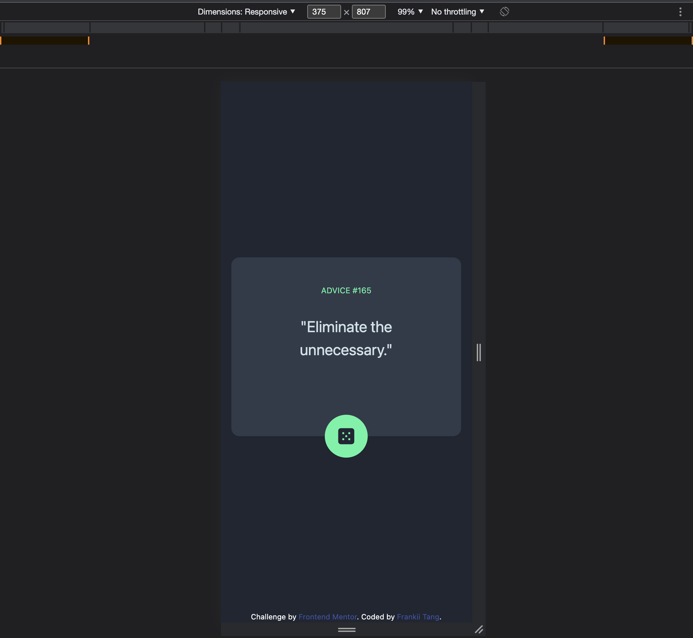

# Frontend Mentor - Advice generator app solution

This is a solution to the [Advice generator app challenge on Frontend Mentor](https://www.frontendmentor.io/challenges/advice-generator-app-QdUG-13db). Frontend Mentor challenges help you improve your coding skills by building realistic projects.

## Table of contents

- [Overview](#overview)
  - [The challenge](#the-challenge)
  - [Screenshot](#screenshot)
  - [Links](#links)
- [My process](#my-process)
  - [Built with](#built-with)
  - [Notes](#notes)
- [Author](#author)

## Overview

### The challenge

Users should be able to:

- View the optimal layout for the app depending on their device's screen size
- See hover states for all interactive elements on the page
- Generate a new piece of advice by clicking the dice icon

### Screenshot

### Links

- Solution URL: [Advice Genrator App Challenge](https://github.com/nocturne-dev/advice-generator-app-challenge)
- Live Site URL: [Solution](https://elaborate-otter-d2b8ba.netlify.app)

## My process

### Built with

- Semantic HTML5 markup
- Mobile-first workflow
- [React](https://reactjs.org/) - JS library
- [Astro](https://astro.build/) - UI framework
- [TailwindCSS](https://tailwindcss.com/) - For styles

### Notes

As of this update, the API call on FireFox is not working correctly, at least when I used it. However, the API call on Chrome is working fine, so for the time being, use Chrome (and possibly other browsers) if you want to check the project out.

## Author

- Website - [Frankii Tang](https://www.github.com/nocturne-dev)
- Frontend Mentor - [@nocturne-dev](https://www.frontendmentor.io/profile/nocturne-dev)
